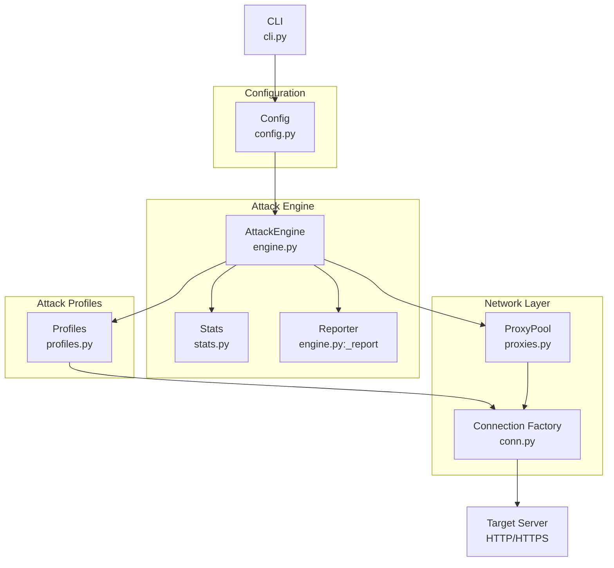
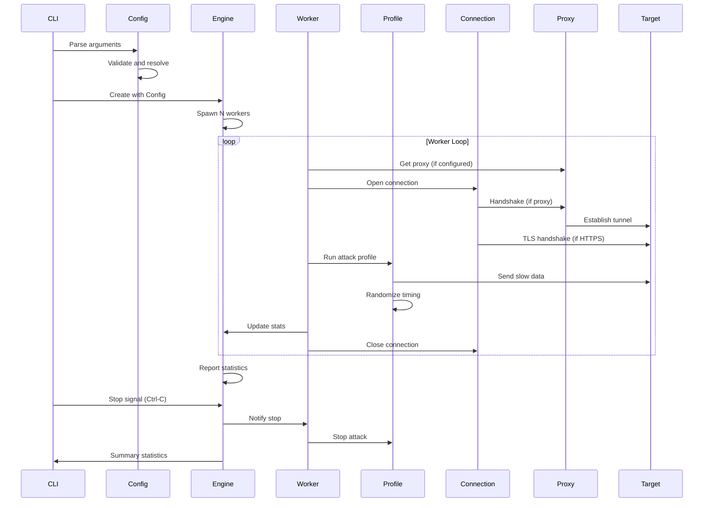

# Architecture Documentation

## Overview

Torshammer 2.0 is built on Python's asyncio framework, enabling it to manage tens of thousands of concurrent connections with a single event loop. The architecture follows a modular design with clear separation of concerns.

## System Architecture

## Module Responsibilities

### `cli.py` - Command Line Interface

**Responsibilities:**
- Argument parsing using `argparse`
- Target URL resolution and validation
- Configuration object construction
- Signal handling (SIGINT, SIGTERM)
- Orchestration of attack engine
- Summary statistics display

**Key Functions:**
- `build_parser()` - Constructs argument parser with all options
- `_resolve_config()` - Converts CLI args to Config object
- `_run()` - Async main function that runs the attack engine
- `_print_summary()` - Displays final statistics

**Security Considerations:**
- Validates URL schemes (http/https only)
- Handles proxy credentials in URLs
- Implements graceful shutdown on signals

### `config.py` - Configuration Model

**Responsibilities:**
- Centralized configuration dataclass
- Default value management
- SSL context creation
- Random delay generation
- SNI hostname resolution

**Key Class:**
- `Config` - Dataclass containing all runtime configuration

**Properties:**
- `server_hostname` - Returns SNI hostname for TLS or None for HTTP
- `ssl_context()` - Creates SSL context with or without verification

**Security Considerations:**
- Supports TLS certificate verification bypass (for testing only)
- Does not log sensitive configuration values
- Proxy credentials stored in memory only

### `engine.py` - Attack Engine

**Responsibilities:**
- Manages asyncio worker pool
- Coordinates attack profiles
- Handles statistics collection
- Implements graceful shutdown
- Manages proxy rotation

**Key Class:**
- `AttackEngine` - Main orchestrator

**Methods:**
- `run()` - Main async method that spawns workers and reporter
- `_worker()` - Individual worker that runs attack profiles
- `_report()` - Periodic statistics reporter

**Worker Lifecycle:**
1. Acquire proxy (if configured)
2. Select User-Agent
3. Open connection via Connection Factory
4. Run attack profile
5. Handle errors with backoff
6. Close connection
7. Repeat until stop signal

**Security Considerations:**
- Implements connection backoff on errors
- Respects stop signal for graceful shutdown
- Does not persist sensitive data

### `profiles.py` - Attack Profiles

**Responsibilities:**
- Implements four attack vectors
- Randomizes request characteristics
- Manages slow data transmission
- Evades simple fingerprinting

**Attack Profiles:**

#### `SlowPost` (Classic Tor's Hammer)
- Sends POST with large Content-Length
- Dribbles body one byte at a time
- Keeps connection open indefinitely

#### `SlowHeaders` (Slowloris)
- Sends GET request line
- Never sends terminating blank line
- Continues adding headers slowly

#### `SlowRead` (Slow-Bytes)
- Sends complete request
- Reads response in tiny chunks
- Pauses between reads

#### `Chunked`
- Sends POST with Transfer-Encoding: chunked
- Dribbles small chunks
- Never sends terminating 0-chunk

**Randomization Techniques:**
- Random User-Agent per connection
- Random Accept header
- Random X-Forwarded-For header
- Random X-Trace-Id header
- Random query parameters
- Random timing delays

**Security Considerations:**
- Uses cryptographically secure random for tokens
- Does not include exploit payloads
- Relies on HTTP protocol compliance

### `conn.py` - Connection Factory

**Responsibilities:**
- Opens plain HTTP connections
- Opens HTTPS/TLS connections with SNI
- Implements SOCKS5 handshake with authentication
- Implements SOCKS4a handshake
- Implements HTTP CONNECT tunneling
- Handles TLS upgrade after proxy handshake

**Key Function:**
- `open_connection()` - Unified connection factory

**Proxy Handshakes:**
- `_connect_socks5()` - SOCKS5 with optional username/password
- `_connect_socks4()` - SOCKS4a with remote DNS resolution
- `_connect_http()` - HTTP CONNECT with Basic authentication

**Security Considerations:**
- Validates proxy responses
- Implements timeout handling
- Supports TLS certificate verification
- Does not log proxy credentials

### `proxies.py` - Proxy Management

**Responsibilities:**
- Parses proxy URLs
- Manages proxy rotation
- Implements round-robin selection
- Implements random selection

**Key Classes:**
- `Proxy` - Single proxy endpoint configuration
- `ProxyPool` - Proxy selection strategy

**Supported Schemes:**
- `socks5://` - SOCKS5 with optional authentication
- `socks4://` - SOCKS4a with remote DNS
- `http://` - HTTP CONNECT tunneling
- `https://` - Treated as HTTP CONNECT

**Security Considerations:**
- URL-encoded credentials are decoded
- Credentials stored in memory only
- No credential persistence

### `useragents.py` - User-Agent Management

**Responsibilities:**
- Provides default User-Agent list
- Loads custom User-Agent from file
- Handles comments and blank lines

**Key Function:**
- `load_user_agents()` - Loads from file or returns defaults

**Default User-Agents:**
- Modern browsers (Chrome, Firefox, Safari, Edge)
- Mobile browsers (iOS, Android)
- Googlebot
- Multiple versions for fingerprinting evasion

**Security Considerations:**
- Does not validate User-Agent strings
- Falls back to defaults if file is empty

### `stats.py` - Statistics

**Responsibilities:**
- Aggregates connection statistics
- Formats byte sizes for human readability
- Tracks timing information

**Key Class:**
- `Stats` - Thread-safe statistics container

**Fields:**
- `connections` - Total connections opened
- `active` - Currently active connections
- `peak_active` - Peak concurrent connections
- `completed` - Completed attack cycles
- `errors` - Connection errors
- `bytes_sent` - Total bytes sent
- `bytes_received` - Total bytes received
- `start` - Start timestamp

**Security Considerations:**
- No sensitive data in statistics
- Updated from single event loop (thread-safe)

## Data Flow

## Asyncio Event Loop

The attack engine uses a single asyncio event loop to manage all workers:

1. **Worker Spawning** - Creates N async tasks (one per concurrency level)
2. **Worker Execution** - Each worker runs independently in the event loop
3. **Statistics Reporting** - Separate async task reports periodically
4. **Signal Handling** - SIGINT/SIGTERM sets stop event
5. **Graceful Shutdown** - Workers observe stop event and exit cleanly

**Benefits:**
- Single event loop handles thousands of connections
- No thread synchronization issues
- Efficient I/O multiplexing
- Clean shutdown handling

## Worker Pool Design

Each worker is an independent async task that:

1. **Acquires Resources** - Gets proxy and User-Agent
2. **Opens Connection** - Via connection factory
3. **Runs Profile** - Executes attack profile until stop signal
4. **Handles Errors** - Implements backoff on failures
5. **Cleans Up** - Closes connection and updates stats
6. **Repeats** - Loops until stop signal

**Error Handling:**
- Connection errors trigger backoff (0.3s sleep)
- Continuous failure loops are detected and throttled
- Statistics track error counts
- Verbose mode logs error details

## Memory Management

- **No connection pooling** - Each connection is closed after use
- **No data persistence** - Statistics only in memory
- **No logging** - No file I/O during operation
- **Graceful cleanup** - All connections closed on shutdown

## Concurrency Model

- **Single-process** - No multiprocessing
- **Single event loop** - All I/O in one loop
- **Cooperative multitasking** - Workers yield via async/await
- **No shared state** - Statistics updated atomically
- **No locks needed** - Single-threaded event loop

## Extension Points

To add a new attack profile:

1. Create a new class inheriting from `Profile` in `profiles.py`
2. Implement the `run()` method
3. Add to `PROFILES` dictionary
4. Update CLI choices in `cli.py`

To add a new proxy type:

1. Add handshake function in `conn.py`
2. Add scheme to `_SUPPORTED` in `proxies.py`
3. Add default port to `_DEFAULT_PORTS` in `proxies.py`
4. Update `_handshake()` in `conn.py`

## Performance Characteristics

- **Scalability** - Limited by file descriptor limits, not threads
- **Memory** - O(concurrency) memory footprint
- **CPU** - Low CPU usage (I/O bound)
- **Network** - Generates low-bandwidth, long-lived connections

## Security Architecture

- **No privilege escalation** - Runs as normal user
- **No persistence** - No files written during operation
- **No data exfiltration** - Only statistics collected
- **No credential theft** - Does not handle target credentials
- **Proxy support** - Can anonymize traffic
